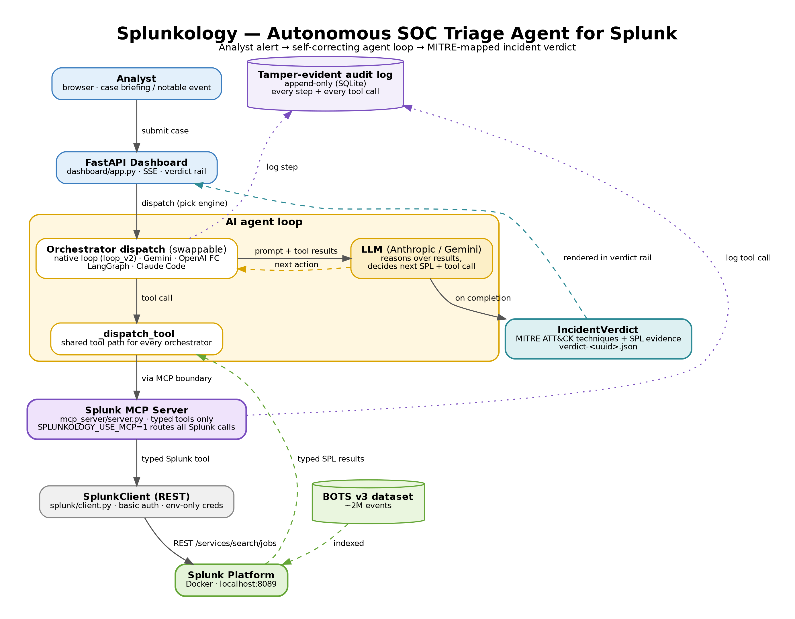

# Splunkology

**Autonomous SOC triage for Splunk — raw events to a MITRE ATT&CK–mapped incident verdict, with no analyst in the loop.**


Splunkology is an autonomous security operations agent that runs directly against a live Splunk index. Hand it an alert and it works the case the way a tier-1 analyst would: it writes and runs its own SPL, pivots across the data to chase down related activity, maps what it finds to MITRE ATT&CK, and emits a structured incident verdict — every claim linked back to the exact Splunk events that support it and written to a tamper-evident audit log. Every Splunk query the agent runs is dispatched through the Splunk MCP server, so the same agent works against any MCP-compatible host.

**Potential impact:** tier-1 SOC triage is the highest-volume, lowest-leverage work in any security team. Splunkology automates it end to end — turning 2M raw events into a defensible, MITRE-mapped incident report in ~90 seconds, freeing analysts for the investigations that actually need a human.

**Splunk Agentic Ops Hackathon 2026 · Security track** · Public repository · MIT

---

## What it does

Given a case briefing or a notable event, Splunkology autonomously issues SPL searches against your Splunk instance, correlates the results into an incident hypothesis, maps its findings to MITRE ATT&CK techniques, and emits a structured verdict with the supporting SPL attached as evidence — writing every step to an append-only audit log as it goes.

Core ideas:

- **Splunk-native investigation.** The agent reasons over results from SPL searches and notable events, not raw files.
- **Typed MCP tool surface.** Every Splunk action the agent can take is a schema-validated tool routed through the MCP server (`SPLUNKOLOGY_USE_MCP=1`), not free-form shell or raw SPL injection.
- **Multi-orchestrator, MCP everywhere.** Native loop, LangGraph, OpenAI function-calling, Gemini, and Claude Code headless all share the same dispatch path, so every orchestrator routes through the same MCP boundary. Orchestration is the only variable.
- **Tamper-evident audit log.** Every tool call and agent step is written to an append-only store, so each line of a verdict traces back to the SPL query that produced it.

---

## Status

| Area | State |
|---|---|
| Core agent loop + typed MCP boundary | Done, green |
| Multi-orchestrator adapters (native, Gemini, OpenAI, LangGraph, Claude Code) | Done, green |
| MCP routing for all orchestrators (`SPLUNKOLOGY_USE_MCP=1`) | Done, green |
| Append-only audit trail | Done, green |
| Splunk REST transport (`splunk/client.py`) | Done — `/services/search/jobs`, basic auth, env-only credentials |
| BOTS v3 dataset loader | Done |
| SOC verdict schema (`IncidentVerdict`: MITRE techniques + SPL evidence) | Wired through prompt → validator → loop; emits `verdict-<uuid>.json` |
| SOC triage dashboard (verdict rail, SSE) | Functional |
| Architecture diagram | Committed — `architecture_diagram.png` |
| Live runs against BOTS v3 | Captured |
| Demo video (< 3 min) | In progress |

Test suite: `266 passed` locally (`python3 -m pytest -q`). These are unit/integration tests of the harness and tooling; they are **not** accuracy measurements against Splunk data.

---

## Quick start

> Requires a Splunk instance (free Splunk account → 60-day Enterprise trial → Developer License via the Splunk Developer Program) and an Anthropic API key.

```bash
git clone https://github.com/Nafsgerman/splunkology.git
cd splunkology
python3 -m venv .venv && source .venv/bin/activate
pip install -e ".[dev]"
cp .env.example .env
```

Then edit `.env` and set your real values (this file is gitignored and never committed):

```
ANTHROPIC_API_KEY=your_anthropic_key_here
SPLUNK_URL=https://your-splunk-host:8089
SPLUNK_USER=your_splunk_user
SPLUNK_PASS=your_splunk_password
```

Credentials are read from the environment at runtime and fail loud if unset — there are no hardcoded defaults anywhere in the code.

### Run an investigation

```bash
export SPLUNKOLOGY_USE_MCP=1
uvicorn splunkology.dashboard.app:app --host 0.0.0.0 --port 8080
```

Open `http://localhost:8080`, pick an orchestrator, and run a case against your BOTS index. Each Splunk call prints `↪ via MCP server: <tool>` to stderr, and a structured verdict is written to `verdict-<uuid>.json`. Running the same case under two different orchestrators (e.g. native → Gemini) demonstrates that the orchestration layer is swappable while the model and typed tools stay fixed.

### Run the test suite

```bash
python3 -m pytest -q
```

---

## Architecture



Browser → FastAPI dashboard → swappable orchestrator dispatch → native agent loop (`loop_v2`) → typed MCP tool boundary → Splunk REST → Splunk platform, with a tamper-evident SQLite audit trail recording every step. The MCP boundary is schema-validated: the agent can only call defined Splunk tools, never free-form shell or raw SPL injection. The dashed node marks planned Splunk-native AI integration (Hosted Models / AI Assistant) reachable over the same REST seam.

---

## Splunk integration

- **MCP boundary:** every Splunk action is exposed as a typed tool through the MCP server (`src/splunkology/mcp_server/server.py`). Setting `SPLUNKOLOGY_USE_MCP=1` routes every orchestrator's Splunk calls through that server via the shared dispatch path; the `↪ via MCP server:` line confirms it on every call.
- **Transport:** REST against `/services/search/jobs`, basic auth, with a transport seam (`_transport`) so a Bearer / hosted path can drop in without changes above the seam.
- **Credentials:** env-only (`SPLUNK_URL` / `SPLUNK_USER` / `SPLUNK_PASS`), fail-loud, no hardcoded values.
- **Roadmap:** a Splunk-native model capability (Hosted Models / AI Assistant) is reachable over the same REST transport and is the next integration target.

---

## Evaluation

The multi-orchestrator harness holds the model API and the typed tools fixed so that orchestration is the only variable under test. Splunkology has been exercised against BOTS v3 in repeated live runs; each run emits a structured verdict with per-claim SPL evidence and a complete audit trail.

Formal accuracy scoring is internal and intentionally not claimed here. Prior-project metrics do not transfer to this domain and have been removed.

---

## Configuration

Environment variables (all documented in `.env.example`):

| Variable | Purpose |
|---|---|
| `ANTHROPIC_API_KEY` | Anthropic model access |
| `SPLUNK_URL` | Splunk REST endpoint (e.g. `https://host:8089`) |
| `SPLUNK_USER` | Splunk username |
| `SPLUNK_PASS` | Splunk password (fail-loud if unset) |
| `SPLUNKOLOGY_USE_MCP` | Route all Splunk tool calls through the MCP server (`1` to enable) |
| `SPLUNKOLOGY_MODEL` | Model identifier for the agent loop |
| `SPLUNKOLOGY_PROMPT_VERSION` | Prompt version selector |
| `SPLUNKOLOGY_MAX_AGENT_ITERATIONS` | Agent loop iteration cap |
| `SPLUNKOLOGY_LOG_LEVEL` | Logging verbosity |
| `SPLUNKOLOGY_AUDIT_DB` | Path to the append-only audit DB |

---

## Project structure

```
src/splunkology/
├── agent/              # agent loop, prompts
├── orchestrators/      # native, Gemini, OpenAI FC, LangGraph, Claude Code adapters
├── mcp_server/         # typed MCP server + safe_exec boundary
├── splunk/client.py    # Splunk REST transport (env-only creds)
├── models/soc.py       # SOC verdict schema (IncidentVerdict, MITRE, SPL evidence)
├── eval/               # multi-orchestrator evaluation harness
├── dashboard/app.py    # FastAPI + SSE dashboard (SOC triage view)
└── cli/main.py         # CLI entry point
tests/                  # unit + integration (not accuracy measurements)
docs/                   # ADRs, architecture diagram, limitations
```

---

## Roadmap to submission

- [x] Splunk SOC identity, labels, packaging
- [x] Env-only credentials, no hardcoded secrets
- [x] Remove dead forensic infrastructure
- [x] Wire `IncidentVerdict` (MITRE techniques + SPL evidence) through prompt → validator → loop
- [x] BOTS v3 dataset loader end-to-end
- [x] MCP routing for all orchestrators
- [x] SOC triage dashboard (Design judging artifact)
- [x] Architecture diagram committed
- [ ] Demo video (< 3 min)
- [ ] Submission write-up

---

## Prior work

Splunkology reuses architecture scaffolding from my own earlier open-source work (typed tool boundary, self-correcting agent loop, append-only audit trail, multi-orchestrator harness — all MIT, all mine). Everything that makes it a Splunk SOC agent was built during the hackathon submission period: the Splunk REST transport, MCP routing, BOTS v3 loader, the `IncidentVerdict` schema and its prompt/validator/loop wiring, the SOC triage dashboard, and the evaluation harness.

## License

MIT — see [`LICENSE`](LICENSE).

---

## Architecture Decision Records

Design decisions are documented in [`docs/adr/`](docs/adr/).
