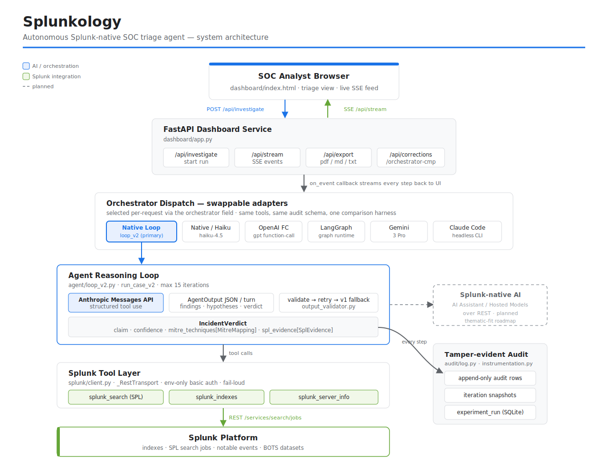

# Splunkology

> ⚠️ **Work in progress.** Splunkology is under active development for the Splunk Agentic Ops Hackathon (deadline Jun 15, 2026). The Splunk-native integration, evaluation on Splunk data, UI, and architecture diagram are being built now. Sections marked `[FILL]` are pending real measurement or artifacts — they are intentionally empty rather than carried over from prior work.

**Splunk-native autonomous incident triage — swappable LLM orchestrators over a typed Splunk tool layer, every step recorded in a tamper-evident audit log. Retargeted from the SIFTGuard DFIR engine.**

An autonomous SOC (Security Operations) agent for **Splunk**. Splunkology runs a self-correcting agent loop against Splunk data — issuing SPL searches, reading notable events, and producing structured incident verdicts — through a typed MCP tool surface, with a multi-orchestrator evaluation harness so the orchestration layer is not coupled to a single LLM vendor.

**Splunk Agentic Ops Hackathon 2026 · Security track** · Public repository · MIT

---

## Project origin (disclosure)

Splunkology began as **SIFTGuard**, an autonomous DFIR (digital forensics) agent I built that ran forensic tooling (Volatility, The Sleuth Kit, RegRipper) against memory and disk images. For this hackathon I am retargeting it to be **Splunk-native**: the evidence layer is moving from forensic disk/memory images to Splunk search and BOTS datasets, the tool surface is moving from forensic binaries to SPL/notable-event tools, and the framing is moving from forensic/legal "spoliation" to SOC triage and a tamper-evident audit log.

**What is carried over:** the architecture spine — a typed MCP server boundary, an instrumented self-correcting agent loop, an append-only audit trail, and a multi-orchestrator evaluation harness.

**What is new / being rebuilt for Splunk:** the Splunk REST transport (`splunk/client.py`), the BOTS dataset loader, the SOC verdict schema (MITRE technique mappings + SPL evidence), the SOC triage UI, and all evaluation numbers (the prior forensic F1 results do **not** transfer — Splunk-native measurement is in progress).

This is an openly-disclosed retarget, not a from-scratch build. Reuse of my own prior work is intentional and stated here so the lineage is transparent.

---

## What it does

`[FILL — one or two sharp sentences: what Splunkology concretely does on Splunk data. e.g. "Given a notable event or a case briefing, Splunkology autonomously issues SPL searches against your Splunk instance, correlates results into an incident hypothesis, maps findings to MITRE ATT&CK techniques, and emits a structured verdict with the supporting SPL as evidence."]`

Core ideas:

- **Splunk-native investigation.** The agent reasons over results from SPL searches and notable events, not raw files.
- **Typed MCP tool surface.** Every Splunk action the agent can take is a schema-validated tool, not free-form shell or arbitrary SPL injection.
- **Multi-orchestrator harness.** The same model API and the same typed tools are held fixed across multiple orchestration adapters (native loop, LangGraph, OpenAI function-calling, Gemini, Claude Code headless) so orchestration is the only variable under test.
- **Tamper-evident audit log.** Every tool call and agent step is written to an append-only store, so each line of a verdict traces back to the SPL query that produced it.

---

## Status (honest snapshot)

| Area | State |
|---|---|
| Core agent loop + typed MCP boundary | Carried over, green |
| Multi-orchestrator adapters | Carried over, green |
| Append-only audit trail | Carried over, green |
| Splunk REST transport (`splunk/client.py`) | In progress — REST `/services/search/jobs`, basic auth, env-only credentials |
| BOTS dataset loader | In progress |
| SOC verdict schema wiring (MITRE + SPL evidence) | In progress — schema defined, not yet wired through prompt → validator → loop |
| Splunk-native UI (SOC triage view) | Not started — Phase 2 |
| Architecture diagram (Splunk + AI + data flow) | Not started — Phase 2, hard submission requirement |
| Evaluation on Splunk / BOTS data | Not started — no Splunk numbers measured yet |
| Demo video (< 3 min) | Not started — Phase 2 |

Test suite: `252 passed` locally (`python3 -m pytest -q`). These are unit/integration tests of the harness and tooling; they are **not** accuracy measurements against Splunk data.

---

## Quick start

> Requires a Splunk instance (free Splunk account → 60-day Enterprise trial → Developer License via the Splunk Developer Program) and an Anthropic API key.

```bash
git clone https://github.com/Nafsgerman/splunkology.git
cd splunkology
python3 -m venv .venv && source .venv/bin/activate
pip install -e ".[dev]"
cp .env.example .env
```

Then edit `.env` and set your real values (this file is gitignored and never committed):

```
ANTHROPIC_API_KEY=your_anthropic_key_here
SPLUNK_URL=https://your-splunk-host:8089
SPLUNK_USER=your_splunk_user
SPLUNK_PASS=your_splunk_password
```

Credentials are read from the environment at runtime and fail loud if unset — there are no hardcoded defaults anywhere in the code.

### Run an investigation

```bash
splunkology investigate CASE-001 \
  --briefing "Possible credential-stuffing against the auth tier." \
  --notable <notable_event_id>
```

> The CLI interface is in progress; the invocation above is the target shape, not yet a tested end-to-end command. See Status.

### Start the dashboard

```bash
uvicorn splunkology.dashboard.app:app --host 0.0.0.0 --port 8080
```

Open `http://localhost:8080`.

> Note: the dashboard UI is mid-migration from the prior forensic layout to a Splunk SOC triage view. See Status above.

### Run the test suite

```bash
python3 -m pytest -q
```

---

## Architecture

> The diagram below is a text sketch for orientation. The **submission requires an image diagram in the repo root** (showing Splunk interaction, AI/agent integration, and data flow) — that artifact is being produced in Phase 2 and is not yet committed.

```
                          ┌──────────────────────────────┐
   Analyst input          │   Splunkology agent loop      │
   (case briefing or  ───►│   hypothesis → tool calls →   │
    notable event)        │   verdict, self-correcting    │
                          └───────────────┬───────────────┘
                                          │
                  orchestration adapter (one of):
       native loop · LangGraph · OpenAI FC · Gemini · Claude Code
                                          │
                          ┌───────────────▼───────────────┐
                          │       Typed MCP server         │
                          │  schema-validated tools only — │
                          │  no free-form shell or raw SPL │
                          └───────────────┬───────────────┘
                                          │ REST  /services/search/jobs
                          ┌───────────────▼───────────────┐
                          │            Splunk              │
                          │   SPL searches · notable       │
                          │   events · BOTS datasets       │
                          └───────────────┬───────────────┘
                                          │ typed results
                          ┌───────────────▼───────────────┐
                          │   Structured incident verdict  │
                          │   MITRE ATT&CK techniques +     │
                          │   SPL evidence per claim        │
                          └───────────────┬───────────────┘
                                          │ every step + tool call
                          ┌───────────────▼───────────────┐
                          │   Append-only audit log        │
                          │   (tamper-evident; each verdict │
                          │   line traces to its SPL query) │
                          └────────────────────────────────┘

  AI integration: the agent loop is model-driven (Anthropic today; a
  Splunk-native capability — Hosted Models / AI Assistant — is on the
  roadmap). Orchestration is the only variable held against a fixed
  model + fixed typed tools.
```

---

## Splunk integration

- **Transport:** REST against `/services/search/jobs`, basic auth, with a transport seam (`_transport`) so a future Splunk MCP Server / Bearer path can drop in without changes above the seam.
- **Credentials:** env-only (`SPLUNK_URL` / `SPLUNK_USER` / `SPLUNK_PASS`), fail-loud, no hardcoded values.
- `[FILL — which Splunk AI capability you leverage. The hackathon explicitly asks projects to use one or more of: Splunk MCP Server, Splunk Hosted Models, AI Assistant, AI Toolkit. As currently built the agent runs its own Claude loop over SPL — flag and close this gap. Hosted Models / AI Assistant are reachable over REST.]`

---

## Evaluation

The evaluation harness (multi-orchestrator comparison on a fixed model and fixed typed tools) is carried over from the prior project. Its methodology document is being rewritten for the Splunk domain and is intentionally not linked here until it reflects Splunk-native scoring rather than forensic ones.

**Splunk-native accuracy numbers: `[FILL — not yet measured]`.** No F1, precision/recall, or cost figures against Splunk/BOTS data exist yet. Prior forensic-dataset results are not transferable to this domain and have been removed. This section will be populated once the agent is running end-to-end against BOTS data.

---

## Configuration

Environment variables (all documented in `.env.example`):

| Variable | Purpose |
|---|---|
| `ANTHROPIC_API_KEY` | Anthropic model access |
| `SPLUNK_URL` | Splunk REST endpoint (e.g. `https://host:8089`) |
| `SPLUNK_USER` | Splunk username |
| `SPLUNK_PASS` | Splunk password (fail-loud if unset) |
| `SPLUNKOLOGY_MODEL` | Model identifier for the agent loop |
| `SPLUNKOLOGY_PROMPT_VERSION` | Prompt version selector |
| `SPLUNKOLOGY_MAX_AGENT_ITERATIONS` | Agent loop iteration cap |
| `SPLUNKOLOGY_LOG_LEVEL` | Logging verbosity |
| `SPLUNKOLOGY_AUDIT_DB` | Path to the append-only audit DB |

---

## Project structure

```
src/splunkology/
├── agent/              # agent loop, prompts
├── mcp_server/         # typed MCP server + safe_exec boundary
├── splunk/client.py    # Splunk REST transport (env-only creds)
├── models/soc.py       # SOC verdict schema (IncidentVerdict, MITRE, SPL evidence)
├── eval/               # multi-orchestrator evaluation harness
├── dashboard/app.py    # FastAPI + SSE dashboard (UI mid-migration)
└── cli/main.py         # CLI entry point
tests/                  # unit + integration (not accuracy measurements)
docs/                   # ADRs, eval framework, limitations
```

---

## Roadmap to submission

- [x] Retarget identity, labels, packaging to Splunk SOC framing
- [x] Env-only credentials, no hardcoded secrets
- [x] Remove dead forensic infrastructure (Docker / SIFT container)
- [ ] Wire `IncidentVerdict` (MITRE techniques + SPL evidence) through prompt → validator → loop
- [ ] BOTS dataset loader end-to-end
- [ ] Splunk SOC triage UI (Design judging artifact)
- [ ] Architecture diagram in repo root (hard requirement)
- [ ] Leverage a Splunk-native AI capability (Hosted Models / AI Assistant)
- [ ] Measure accuracy on Splunk/BOTS data
- [ ] Demo video (< 3 min)
- [ ] "What changed and when" retarget note for the submission form

---

## License

MIT — see [`LICENSE`](LICENSE).

---

## Architecture Decision Records

Design decisions are documented in [`docs/adr/`](docs/adr/). Note: several ADRs are mid-rewrite from forensic to Splunk SOC framing (e.g. ADR-007's "spoliation" → "tamper-evident SOC audit log").
## Architecture



Browser to FastAPI dashboard to swappable orchestrator dispatch to native agent loop (loop_v2) to Splunk REST tools to Splunk platform, with a tamper-evident SQLite audit trail recording every step. The dashed node marks planned Splunk-native AI integration over REST.
