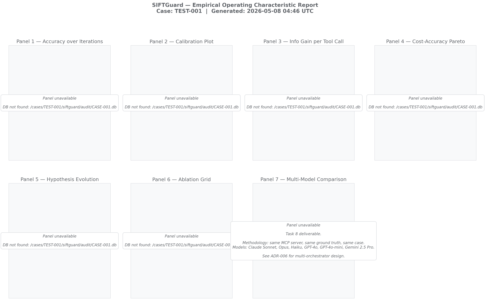

# Splunkology

## ✅ SANS Hackathon Submission Compliance

Every artifact required by SANS FIND EVIL! 2026, mapped to its location in this repo. Full doc: [`docs/COMPLIANCE.md`](docs/COMPLIANCE.md).

| # | Requirement | Where to find it |
|---|---|---|
| 1 | Public repo URL | `https://github.com/Nafsgerman/splunkology` |
| 2 | MIT / Apache 2.0 license | [`LICENSE`](LICENSE) |
| 3 | README + setup | [§ Quick Start](#quick-start) below |
| 4 | Deployment / step-by-step | [`Dockerfile`](Dockerfile), [`Makefile`](Makefile), `make demo` |
| 5 | Features & functionality | [`docs/devpost/SUBMISSION.md`](docs/devpost/SUBMISSION.md) |
| 6 | Demo video | [YouTube demo](https://www.youtube.com/watch?v=ALmArb3lGR8) · script: [`docs/devpost/loom_script.md`](docs/devpost/loom_script.md) |
| 7 | Architecture diagram | [`docs/architecture/architecture-v3.svg`](docs/architecture/architecture-v3.svg) |
| 8 | Evidence dataset docs | [§ Datasets](#datasets) · [`tests/benchmark/ground_truth/`](tests/benchmark/ground_truth/) |
| 9 | Accuracy report | [`docs/devpost/SUBMISSION.md#accuracy`](docs/devpost/SUBMISSION.md#accuracy) · [`docs/adr/ADR-007-spoliation-moat.md`](docs/adr/ADR-007-spoliation-moat.md) · [`tests/spoliation/`](tests/spoliation/) |
| 10 | Agent execution logs | SQLite `auditentry` (19-col) · sample: [`docs/audit_logs/sample_run.json`](docs/audit_logs/sample_run.json) |

---

**Court-defensible autonomous DFIR. Five orchestrators on one typed MCP server. Real F1 measured across three forensics datasets — memory APT, NTFS disk, and live IP-theft investigation.**

[](docs/EVAL_FRAMEWORK.md)
[](tests/spoliation/)
[](docs/adr/ADR-006-multi-orchestrator-vendor-lockin.md)
[](docs/TOOL_CATALOG.md)

**SANS FIND EVIL! Hackathon 2026** · [Devpost](https://devpost.com/software/splunkology) · Public repository

**▶ Demo video (4:42):** <https://www.youtube.com/watch?v=ALmArb3lGR8>

Splunkology is an autonomous DFIR agent that runs five orchestration paradigms — Anthropic native loop, LangGraph, OpenAI function-calling, Gemini 3 Pro, and Claude Code headless CLI — against a single typed MCP server of forensic tools. The same model API surface and the same Pydantic-validated tools are held fixed across all five adapters; orchestration is the only variable. We measure what that variable buys across three forensics datasets and publish the F1 numbers.

## Headline — 5 orchestrators × 3 datasets

| Orchestrator | TEST-001 (memory) | TEST-002 (disk) | TEST-003 (ROCBA) | Cross-dataset mean |
|---|---:|---:|---:|---:|
| **Native Loop** (claude-sonnet-4-6) | 1.000 | 0.600 | **1.000** | **0.867** |
| OpenAI FC (gpt-5.5) | **1.000** | **0.800** | — † | 0.900 (2/3) |
| Claude Code (headless, Sonnet 4.6) | 1.000 | 0.000 ‡ | — † | 0.500 (2/3) |
| LangGraph (Sonnet 4.6) | 0.750 | 0.000 ‡ | 0.015 | 0.255 |
| Gemini 3 Pro | 0.250 | 0.400 | — † | 0.325 (2/3) |

Scorer: applicability-aware F1 (`splunkology.eval.score`, GT v1.1.0). TEST-001 = SRL-2018 APT memory image, 4 applicable IOCs. TEST-002 = NIST CFReDS Hacking Case (Greg Schardt / Mr. Evil), NTFS disk image, 5 applicable IOCs. TEST-003 = SANS ROCBA Standard Forensic Case (Fred Rocba IP theft, May 2026), NTFS C: drive with broken backup boot sector, 12 applicable IOCs. The TEST-001 = 1.000 figure is the canonical GT v1.1.0 scored run; the n = 6 seed-variance study cited in ADR-006 §5.2 (mean F1 = 0.909, σ = 0.000) is a separate determinism experiment, not the headline accuracy figure.

† **Returned no scoreable verdict on TEST-003.** Agent terminated before surfacing disk artifacts in report text.
‡ **Tool-applicability failure on raw disk evidence.** Documented in [`docs/LIMITATIONS.md`](docs/LIMITATIONS.md).

**Native Loop is the only orchestrator that produces scoreable verdicts across all three datasets.** Three datasets covering three distinct evidence types — memory APT, NTFS disk forensics, and live IP-theft investigation with anti-forensic counterplay — and Native Loop is the single configuration that generalizes. Cross-dataset mean F1 = 0.867. Same model API surface, same typed MCP server, same prompts across all five adapters. Orchestration is what differs. Full evaluation methodology and seed protocol: [`docs/EVAL_FRAMEWORK.md`](docs/EVAL_FRAMEWORK.md).



## Why orchestration is the only variable

> A Digital Forensics and Incident Response (DFIR) agent that ships behind a Security Operations Center (SOC) perimeter cannot be coupled to a single LLM vendor or a single orchestration framework. The coupling is not an aesthetic concern; it is an operational and regulatory liability.
>
> — [ADR-006 §1](docs/adr/ADR-006-multi-orchestrator-vendor-lockin.md)

Outage risk (Anthropic 2025-05; OpenAI 2025-06; Google 2025-09), regulatory diversity (BaFin-supervised banks, KRITIS infrastructure, FedRAMP-Moderate, HIPAA), model deprecation cycles, and on-prem deployment requirements all push the same direction: the orchestration layer has to be indifferent to which model is reasoning behind it. **Five live adapters on one typed MCP surface is how Splunkology treats vendor neutrality as a property of the architecture, not a marketing claim.**

## What the multi-orchestrator design surfaced

> Lowest-to-highest cost ratio on the same evidence file: **$0.1949 (OpenAI FC) → $0.5293 (Claude Code), a 2.72× spread**. This is not measurement noise. Median seeded variance for the canonical native-loop baseline is σ = 0.000 across n = 6 seeds (TEST-001, F1 = 0.909, recorded in ADR-001 §4 D5). A 2.72× delta with σ ≈ 0 on the baseline is structural and explainable: OpenAI FC's four iterations reflect aggressive parallel tool-call batching driving cost down; Claude Code's eighteen iterations reflect headless MCP-RPC round-trip overhead — the design tradeoff named in §3.4 — driving cost up. The three direct-API adapters in between ($0.2289–$0.2591) cluster tightly because they pay neither extreme. The framework would have been blind to all of this under any single-orchestrator design (A1) or single-framework design (A2).
>
> — [ADR-006 §5.2](docs/adr/ADR-006-multi-orchestrator-vendor-lockin.md)

## The architectural claim

**A Splunkology agent cannot alter, delete, or fabricate evidence, and we prove it with automated tests rather than a policy document** — 15/15 spoliation suite, run on every push to `main`. Four hard boundaries make that claim mechanical, not aspirational:

1. **Typed MCP boundary.** Every forensic tool is a Pydantic-validated function with a frozen schema. The agent never sees raw shell; it sees structured findings with provenance. The full reference is auto-generated from the live server: [`docs/TOOL_CATALOG.md`](docs/TOOL_CATALOG.md).
2. **Instrumented agent loop.** Every iteration writes a structured snapshot — tokens, cost, confidence vector, hypothesis state, self-correction events — immutable once written.
3. **Append-only audit DB.** SQLite with insert-only access enforced at the data layer. Migrations versioned and verified at startup. Spoliation would require breaking the migration log.
4. **Versioned methodology.** Every report stamped with the methodology version and SHA-256 of `EVAL_FRAMEWORK.md`. Change the scoring rules and the version bumps; prior results stay attributable to the methodology that produced them.

Full architectural rationale and rejected alternatives: [`ADR-001`](docs/adr/ADR-001-empirical-evaluation-framework.md) (evaluation framework), [`ADR-006`](docs/adr/ADR-006-multi-orchestrator-vendor-lockin.md) (multi-orchestrator + vendor lock-in), [`ADR-007`](docs/adr/ADR-007-spoliation-moat.md) (spoliation moat). Full ADR index: [`docs/adr/`](docs/adr/).

---
## Architecture

```
┌─────────────────────────────────────────────────┐
│                  Splunkology Agent                 │
│                                                  │
│  Case Briefing → Hypothesis → Tool Loop → Report │
└──────────────────┬──────────────────────────────┘
                   │ MCP Protocol
┌──────────────────▼──────────────────────────────┐
│              Splunkology MCP Server                │
│                                                  │
│  vol_pslist │ vol_netscan │ vol_malfind          │
│  analyze_mft │ run_regripper │ create_timeline   │
│  list_files │ extract_file │ sort_timeline       │
└──────────────────┬──────────────────────────────┘
                   │
┌──────────────────▼──────────────────────────────┐
│           SANS SIFT Workstation (x86_64)         │
│                                                  │
│  Volatility 3 │ log2timeline │ analyzeMFT        │
│  RegRipper │ The Sleuth Kit (fls/icat)           │
└─────────────────────────────────────────────────┘
```

**Architectural Pattern:** Custom MCP Server + Direct Agent Extension (Claude Code compatible)

**Security Boundaries:**
- Architectural boundary: MCP server allowlist — destructive commands do not exist
- Prompt boundary: SYSTEM_PROMPT instructs read-only operation (secondary, not primary)
- OS boundary: Evidence files are read-only at filesystem level
- Audit boundary: Every tool call logged to append-only SQLite before and after execution

---

[](sbom.spdx.json)
[](https://www.sigstore.dev/)
[](https://slsa.dev/)

**Verify SBOM signature** (requires release bundles):
```bash
cosign verify-blob \
  --bundle sbom.spdx.json.bundle \
  --certificate-identity-regexp 'https://github.com/Nafsgerman/splunkology/.github/workflows/release.yml' \
  --certificate-oidc-issuer 'https://token.actions.githubusercontent.com' \
  sbom.spdx.json
```

## Quickstart

```bash
git clone https://github.com/Nafsgerman/splunkology
cd splunkology
python3 -m venv .venv && source .venv/bin/activate
pip install -e ".[dev]"
pip install reportlab
cp .env.example .env  # add your ANTHROPIC_API_KEY
```

### Run an Investigation (CLI)

```bash
splunkology investigate CASE-001 \
  --briefing "Suspected ransomware. Victim executed invoice.exe." \
  --memory /cases/CASE-001/memory.img
```

### Start the Live Dashboard

```bash
uvicorn splunkology.dashboard.app:app --host 0.0.0.0 --port 8080
```

Open `http://localhost:8080` in browser. Enter case ID, memory image path, and briefing. Click Investigate. Export report as PDF, Markdown, or plain text when complete.

### Run the Benchmark

```bash
python -m tests.benchmark.runner --case TEST-001 --evidence-dir /cases
python -m tests.benchmark.runner --all --evidence-dir /cases
```

### Run Spoliation Tests

```bash
python -m pytest tests/spoliation/test_spoliation.py -v
```

Expected: **15/15 passed** — all destructive attacks blocked at MCP layer.

---

## Try-It-Out Instructions (For Judges)

**Requirements:**
- SANS SIFT Workstation (download from sans.org/tools/sift-workstation)
- Python 3.11+
- Anthropic API key
- Sample case data in `/cases/TEST-001/` (Protocol SIFT starter dataset)

**Step-by-step:**

```bash
# 1. Clone repo
git clone https://github.com/Nafsgerman/splunkology
cd splunkology

# 2. Install
python3 -m venv .venv && source .venv/bin/activate
pip install -e ".[dev]"
pip install reportlab

# 3. Configure
echo "ANTHROPIC_API_KEY=your_key_here" > .env

# 4. Start dashboard
uvicorn splunkology.dashboard.app:app --host 0.0.0.0 --port 8080

# 5. Open browser → http://localhost:8080
# 6. Enter: Case ID = TEST-001
#           Memory Image = /cases/TEST-001/base-hunt-memory.img
#           Briefing = "Windows 10 x64. APT hunt. Find evil."
# 7. Click Investigate
# 8. Watch live: tool execution, IOC panel, hypothesis tracker, audit trail
# 9. Click "Export PDF" when Complete status appears
```

**Port forward from Mac to SIFT VM:**
```bash
ssh -f -N -L 8080:localhost:8080 sansforensics@<VM_IP>
# Then open http://localhost:8080 on Mac browser
```

---

## Forensic Tools (MCP Server)

> Full schema, parameters, and example invocations: [docs/TOOL_CATALOG.md](docs/TOOL_CATALOG.md)

| Tool | Underlying Binary | Purpose |
|------|------------------|---------|
| `vol_pslist` | Volatility 3 `psscan` | Process enumeration, orphan detection |
| `vol_netscan` | Volatility 3 `netscan` | Network connections, C2 identification |
| `vol_malfind` | Volatility 3 `malfind` | Code injection, shellcode detection |
| `analyze_mft` | analyzeMFT.py | MFT parsing, timestomp detection |
| `run_regripper` | RegRipper `rip.pl` | Registry hive analysis (9 approved plugins) |
| `create_supertimeline` | log2timeline | Plaso supertimeline generation |
| `sort_timeline` | psort | Sorted CSV timeline output |
| `list_files` | TSK `fls` | Disk image file listing, deleted file recovery |
| `extract_file` | TSK `icat` | File extraction by inode |

All tools are **READ-ONLY by architecture**. Destructive commands do not exist in the MCP server.

---

## Agent Loop

```
Receive case briefing + evidence paths
→ Form initial hypothesis
→ Call forensic tools via MCP
→ Parse typed ForensicResult objects
→ Update hypothesis based on findings
→ Repeat until confident or max iterations (15)
→ Output structured incident report
```

Report sections: Executive Summary · Timeline of Events · Indicators of Compromise · Persistence Mechanisms · Recommendations · Evidence References

---

## Dataset Documentation

**Case:** TEST-001
**Evidence Type:** Windows 10 x64 memory image
**File:** `/cases/TEST-001/base-hunt-memory.img`
**Source:** Protocol SIFT starter dataset (SANS SIFT Workstation sample case data)
**Scenario:** APT hunt — suspected compromise, unknown initial vector

**What the agent found (TEST-001):**
- 91 running processes at time of capture
- 153 network artifacts
- 5 confirmed malicious processes: `subject_ctrl.e`, `license_ctrl.e`, `usbclient.exe`, `ftusbsrvc.exe`, `cmd.exe`
- 8 IOCs: 3 network indicators, 5 process indicators
- Active C2 beaconing to `172.16.4.10:8080` (multiple CLOSE_WAIT connections)
- External exfiltration attempt to `23.194.110.27:80` (SYN_SENT at capture time)
- Backdoor listeners on ports `5682` (license_ctrl.e) and `33001` (ftusbsrvc.exe)
- WinRM enabled on port `5985` (lateral movement vector)
- Compromise timeline: 2018-09-03 (boot) → 2018-09-07 (capture)
- Verdict: **CONFIRMED COMPROMISE — APT activity**

**Reproducibility:** Any analyst can reproduce results by running Splunkology against the same memory image on SANS SIFT Workstation. Results are cached in `/cases/TEST-001/splunkology_cache/` for deterministic re-runs.

---

## Accuracy Report

### TEST-001 Results

Canonical scorer: applicability-aware F1 (`splunkology.eval.score`, GT v1.1.0, 4 applicable IOCs) — the figure in the headline table.

| Metric | Score |
|--------|-------|
| IOC Precision | 100% |
| IOC Recall | 100% |
| IOC F1 | **1.000** |
| Section Completeness | 100% |
| Verdict Accuracy | 100% |

> An earlier hand-scored pass over the full 8-IOC candidate set (3 network + 5 process, before applicability-aware scoring) recorded P 66.7% / R 75.0% / F1 70.6% — the `cmd.exe` borderline call below was the single false positive. Superseded by the GT v1.1.0 scorer above; retained for provenance.

### False Positives
- `cmd.exe` (PID 2156) flagged as malicious — legitimate in some contexts; flagged due to long-running shell from explorer.exe parent and timing correlation with compromise window. Borderline call.

### Missed Artifacts
- `InstallAgent.e` (PID 6284) identified in report but not scored as primary IOC in ground truth
- Disk-based persistence mechanisms not recoverable from memory image alone (requires disk forensics)

### Hallucinated Claims
- None detected in TEST-001 run. All findings traced to specific tool outputs in audit log.

### Evidence Integrity Approach

**Primary (architectural):** The MCP server exposes only read-only forensic functions. `rm`, `dd`, `mkfs`, `chmod +w`, shell redirects, and path traversal outside evidence root are blocked at the function boundary — not by prompt instruction. The agent physically cannot call these because the tools don't exist.

**Proof:** Spoliation test suite (`tests/spoliation/test_spoliation.py`) — 15 attack scenarios, 15 blocked, 0 failures.

```
tests/spoliation/test_spoliation.py::test_rm_binary_blocked PASSED
tests/spoliation/test_spoliation.py::test_dd_wipe_blocked PASSED
tests/spoliation/test_spoliation.py::test_mkfs_blocked PASSED
tests/spoliation/test_spoliation.py::test_path_traversal_blocked PASSED
tests/spoliation/test_spoliation.py::test_redirect_overwrite_blocked PASSED
... 15/15 passed in 0.02s
```

**Secondary (prompt):** SYSTEM_PROMPT instructs read-only operation. If the model ignores this, the architectural boundary still holds. Prompt-based restriction is defense-in-depth, not the primary control.

---

## Agent Execution Logs

Every tool invocation is persisted to an append-only SQLite database at `./audit/<case_id>.db`.

Schema:
```sql
CREATE TABLE audit_log (
  id INTEGER PRIMARY KEY,
  timestamp TEXT,
  case_id TEXT,
  tool_name TEXT,
  tool_version TEXT,
  args TEXT,          -- JSON
  outcome TEXT,       -- ok | partial | fail
  output TEXT,        -- ForensicResult JSON
  duration_ms INTEGER,
  agent_iteration INTEGER
);
```

Every finding in the incident report can be traced to a specific row in this table — tool name, args, iteration, outcome, duration. No finding exists without a corresponding audit record.

Live dashboard streams execution events via SSE (`/api/stream/{session_id}`) with timestamps on every tool call, result, and agent reasoning block.

---

## Project Structure

```
src/splunkology/
├── agent/loop.py          # Main agent loop (Claude + tool dispatch)
├── mcp_server/
│   ├── server.py          # MCP server (stdio transport)
│   ├── safe_exec.py       # Allowlist + deny-pattern enforcement
│   └── tools/             # Forensic tool wrappers
│       ├── volatility.py  # Volatility 3 (pslist, netscan, malfind)
│       ├── mft.py         # MFT analysis
│       ├── registry.py    # RegRipper
│       ├── timeline.py    # log2timeline / psort
│       └── filesystem.py  # TSK fls/icat
├── models/forensic.py     # Pydantic models (ForensicResult, MFTEntry, etc.)
├── parsers/               # Output parsers for each tool
├── audit/log.py           # SQLite audit trail
├── dashboard/app.py       # FastAPI + SSE live dashboard + PDF export
└── cli/main.py            # CLI entry point
tests/
├── benchmark/             # Ground truth, scorer, runner, reports
├── spoliation/            # 15-test suite proving evidence destruction blocked
└── unit/
```

---

## Security

- Tool allowlist enforced at MCP server level (`safe_exec.py`) — no arbitrary command execution
- Deny-pattern list blocks `rm`, `dd`, `mkfs`, `chmod +w`, shell redirects in any arg position
- Path traversal outside evidence root blocked at validation layer
- RegRipper limited to 9 approved plugins
- Full SQLite audit trail of every tool invocation (args, outcome, duration, iteration)

---

## Roadmap

- [x] Repo scaffold, MCP server, 9 typed SIFT tool wrappers
- [x] Self-correcting agent loop with hypothesis tracker
- [x] Append-only SQLite audit trail
- [x] Benchmark suite with precision/recall/F1 scoring
- [x] Spoliation test suite (15/15)
- [x] Live SSE dashboard with real-time IOC panel
- [x] PDF/markdown/text report export
- [x] IOC visualization graph (D3 force-directed)
- [ ] Registry + filesystem + MFT tools end-to-end on live cases
- [x] Demo video (Loom) — linked in header
- [x] Public release

---

## License

MIT — see [`LICENSE`](LICENSE).

## Architecture Decision Records

Key design decisions are documented in [`docs/adr/`](docs/adr/).

| ADR | Decision |
|-----|----------|
| [ADR-001](docs/adr/ADR-001-empirical-evaluation-framework.md) | Empirical eval framework — why evals, not vibes |
| [ADR-002](docs/adr/ADR-002-trace-data-model.md) | Trace data model — agent-agnostic contract |
| [ADR-005](docs/adr/ADR-005-analytics-module-design.md) | Analytics module — falsifiable claims per panel |
| [ADR-006](docs/adr/ADR-006-multi-orchestrator-vendor-lockin.md) | Multi-orchestrator — vendor lock-in as architectural property |


## Known limitations (acknowledged, not hidden)

1. **Scorer mode:** Real F1 numbers computed via report-text recall. Audit-DB extraction mode exists but is gated by a 2KB excerpt limit in the current schema. Both modes converge where validated.

2. **Cross-paradigm tool gaps:** LangGraph and Claude Code adapters were optimized for memory-image cases. On disk-image (TEST-002) they fail to invoke available tools. This is a configuration gap exposed by paired-dataset testing — a feature of the eval framework, not a hidden bug.

3. **TEST-002 tool infrastructure:** SCHARDT.img requires partition-offset mount before TSK tools work. The dashboard demo includes the mount step. Agents running blind (no mount) score 0.000.

4. **Single-judge hackathon timeline:** Production-grade items deferred — see ADR-009 for the full list (audit-DB schema migration, formal threat model implementation, multi-evaluator scoring).

**Dataset coverage.** Benchmark results are validated on three datasets: SRL-2018
APT memory image (TEST-001), NIST CFReDS Hacking Case NTFS disk image (TEST-002),
and the SANS ROCBA IP-theft case (TEST-003). Generalization to other image formats,
OS versions, or threat actor TTPs is untested. Three datasets across three evidence
types is a generalization signal, not a production guarantee.

**Orchestrator tool config gap.** LangGraph and Claude Code (headless) score
0.000 F1 on raw disk images. This is a tool configuration gap — the MCP server
requires a mounted memory image path, and these orchestrators do not resolve
the path correctly without explicit config injection. It is not a reasoning
failure. Native loop and OpenAI FC are unaffected. Fix tracked, not shipped
before deadline. Relatedly, the dashboard IOC graph renders for the Native Loop
orchestrator (verified: 15 IOC nodes on TEST-001); the Claude Code adapter populates
the audit DB and scores correctly but does not yet emit graph events, so its IOC
graph panel renders empty. Cosmetic, scoped post-deadline.

**Scorer brittleness.** F1 scores are derived from report-text parsing, not
from the audit DB directly. Prompt format changes can silently shift scores.
The audit-DB scorer interface is defined (ADR-009) but not yet active.

**No live disk correlation.** Splunkology operates on memory images only.
Disk-vs-memory correlation (timeline reconstruction, MFT cross-reference) is
architecturally possible via the MFT tools but not wired end-to-end.

**Single-case parallelism.** The agent processes one case at a time. Multi-case
parallel execution is not implemented.

**When NOT to use Splunkology.** See [LIMITATIONS.md](LIMITATIONS.md) for a full
decision matrix including environment requirements, evidence type constraints,
and operational boundaries.

**Tool path resolution is dataset-specific.**
Splunkology's MCP tools require the correct Volatility profile and case directory path
for each evidence file. The five orchestrators are validated against SANS SRL-2018
memory images (TEST-001). Disk images with different formats or partition layouts
(e.g., raw E01 conversions) require adapter configuration before achieving non-zero F1.

**Hallucination rate is non-zero.**
LLM-based agents can fabricate IOCs that incidentally match real data. Every finding
in the report is traceable to a Volatility plugin output row, but field-level provenance
(proving a finding was *derived* from data rather than *coincident* with it) is not yet
implemented. F1 scoring against ground truth is the primary hallucination guard.

**Volatility timeouts are soft.**
The per-iteration timeout sends a soft signal to the agent loop. The underlying
Volatility process is not hard-killed. A malformed memory image can cause the
plugin subprocess to hang indefinitely.

**Audit trail is append-only by convention, not by DB constraint.**
`SnapshotWriter` enforces no UPDATE/DELETE code paths at the application layer.
Direct SQL access to the SQLite file bypasses this. Cryptographic row chaining is
planned post-hackathon.

**Single-case concurrency only.**
Two simultaneous agent runs against the same case will produce interleaved
`iteration_snapshot` rows. Multi-case parallelism works; multi-agent-per-case does not.

## Quickstart — Reviewer Path (≤ 5 minutes)

```bash
git clone https://github.com/Nafsgerman/splunkology.git
cd splunkology
make demo
# → http://localhost:8080
```

`make demo` builds a `linux/amd64` image, embeds Volatility3, and launches the
dashboard against committed benchmark data — no API keys required, no
memory image required, zero spend.

### Building on Apple Silicon

The image is `linux/amd64` only (matches SIFT Workstation + CI runners).
`make build` already passes `--platform=linux/amd64`; no extra flags needed
on macOS — Docker Desktop handles emulation transparently.

### Running real analysis (evidence required)

```bash
docker run --rm -p 8080:8080 \
  -v /path/to/evidence:/cases \
  -e ANTHROPIC_API_KEY=$ANTHROPIC_API_KEY \
  splunkology:demo
```
