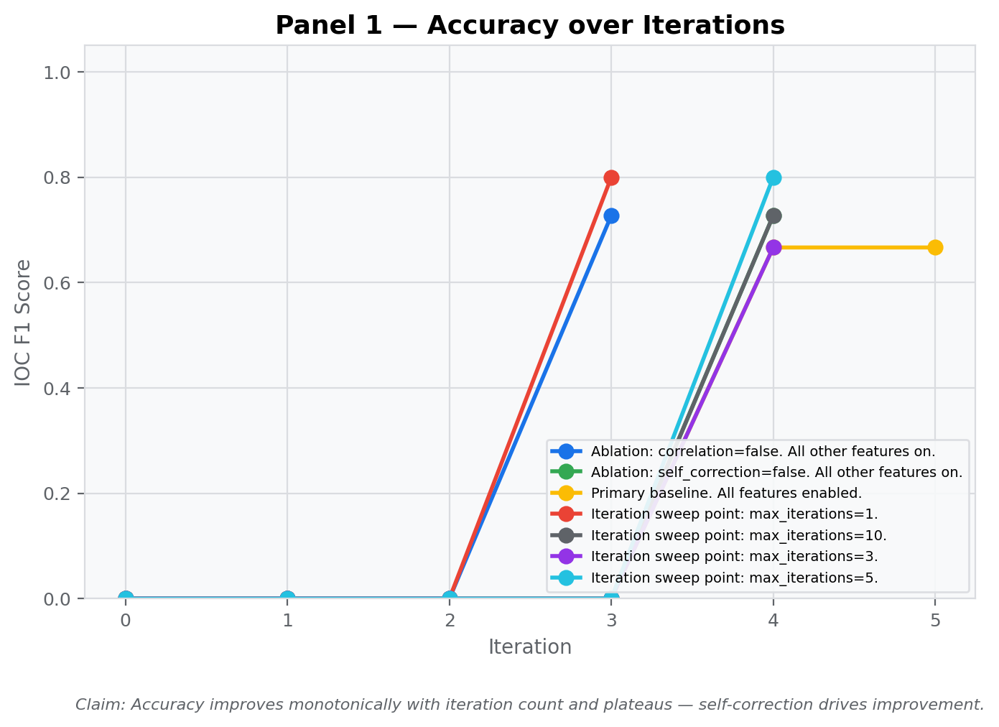
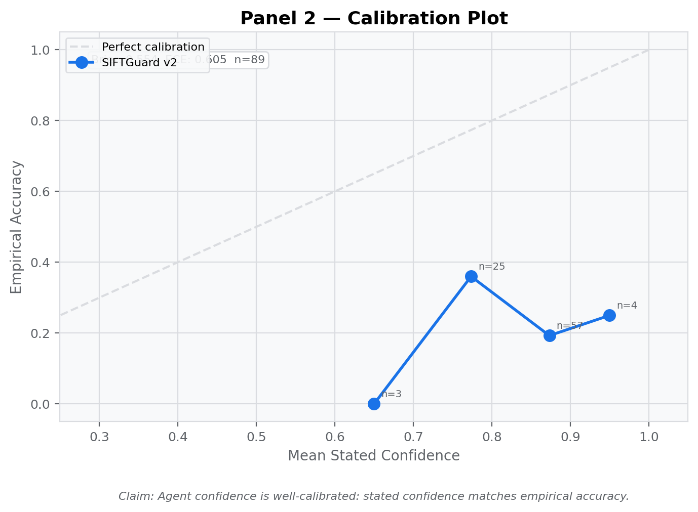
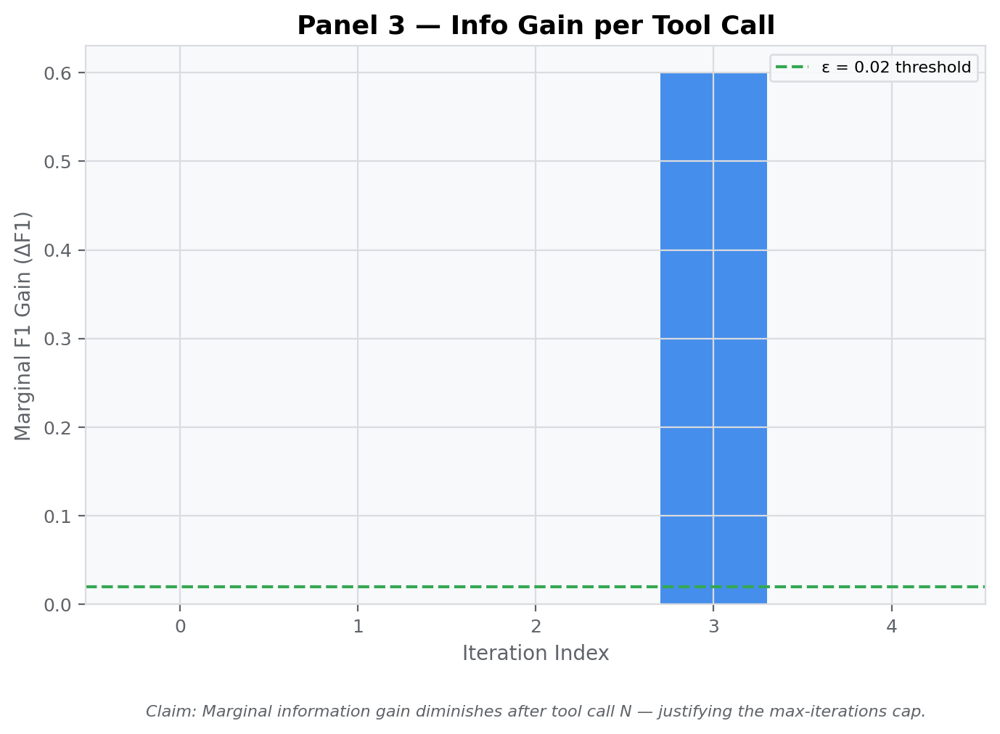
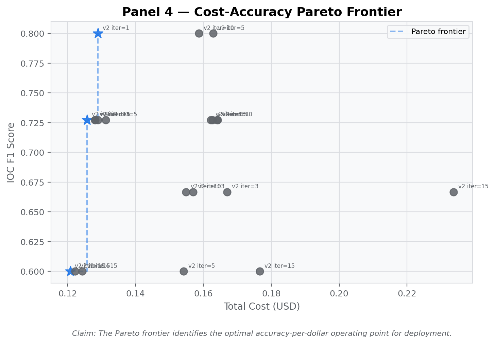
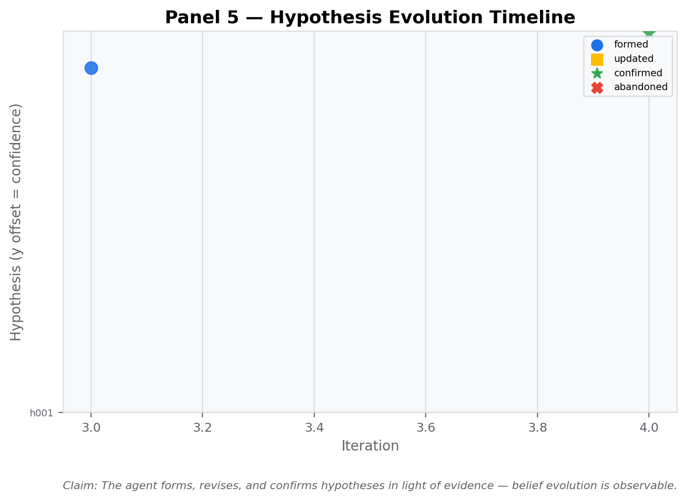
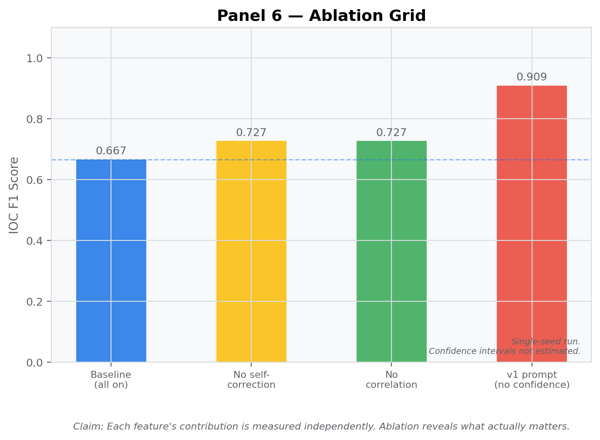
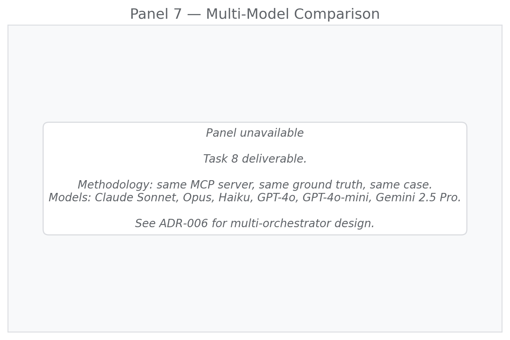

# SIFTGuard Empirical Operating Characteristic Report

**Case:** TEST-001
**Generated:** 2026-05-07 18:37 UTC

## Data Quality Notes

- v2 prompt parse failures fell back to v1 synthesis on several runs. These runs are included in accuracy/ablation panels and excluded from the calibration panel. The parse failure root cause (model emitting tool name strings in `supporting_audit_entry_ids` instead of integers) is documented and fixed in the v2 prompt update (commit: fix/prompt-audit-ids).
- Single-seed runs. Confidence intervals not estimated.

## Panel 1

**Claim:** Accuracy improves monotonically with iteration count and plateaus — self-correction drives improvement.

**Status:** ok

**Data:** {
  "status": "ok"
}

## Panel 2

**Claim:** Agent confidence is well-calibrated: stated confidence matches empirical accuracy.

**Status:** ok

**Data:** {
  "status": "ok",
  "brier": 0.5541112359550563,
  "ece": 0.6052808988764045,
  "n_findings": 89,
  "bin_data": [
    [
      0.65,
      0.0,
      "3"
    ],
    [
      0.7736000000000002,
      0.36,
      "25"
    ],
    [
      0.8733333333333332,
      0.19298245614035087,
      "57"
    ],
    [
      0.95,
      0.25,
      "4"
    ]
  ]
}

## Panel 3

**Claim:** Marginal information gain diminishes after tool call N — justifying the max-iterations cap.

**Status:** ok

**Data:** {
  "status": "ok",
  "run_id": "74ca7f9f-8438-4a2d-ab17-9f7b8c2143be",
  "f1_series": [
    0.0,
    0.0,
    0.0,
    0.6,
    0.6
  ],
  "deltas": [
    0.0,
    0.0,
    0.0,
    0.6,
    0.0
  ]
}

## Panel 4

**Claim:** The Pareto frontier identifies the optimal accuracy-per-dollar operating point for deployment.

**Status:** ok

**Data:** {
  "status": "ok",
  "points": [
    {
      "cost": 0.120759,
      "f1": 0.6,
      "label": "v2 iter=15",
      "is_v1": false
    },
    {
      "cost": 0.12433499999999999,
      "f1": 0.6,
      "label": "v2 iter=15",
      "is_v1": false
    },
    {
      "cost": 0.17664000000000002,
      "f1": 0.6,
      "label": "v2 iter=15",
      "is_v1": false
    },
    {
      "cost": 0.12567599999999998,
      "f1": 0.7273,
      "label": "v2 iter=1",
      "is_v1": false
    },
    {
      "cost": 0.154893,
      "f1": 0.6667,
      "label": "v2 iter=10",
      "is_v1": false
    },
    {
      "cost": 0.12891,
      "f1": 0.7273,
      "label": "v2 iter=3",
      "is_v1": false
    },
    {
      "cost": 0.154158,
      "f1": 0.6,
      "label": "v2 iter=5",
      "is_v1": false
    },
    {
      "cost": 0.128049,
      "f1": 0.7273,
      "label": "v2 iter=15",
      "is_v1": false
    },
    {
      "cost": 0.122256,
      "f1": 0.6,
      "label": "v2 iter=15",
      "is_v1": false
    },
    {
      "cost": 0.16265399999999997,
      "f1": 0.7273,
      "label": "v2 iter=15",
      "is_v1": false
    },
    {
      "cost": 0.16422,
      "f1": 0.7273,
      "label": "v2 iter=1",
      "is_v1": false
    },
    {
      "cost": 0.158631,
      "f1": 0.8,
      "label": "v2 iter=10",
      "is_v1": false
    },
    {
      "cost": 0.166962,
      "f1": 0.6667,
      "label": "v2 iter=3",
      "is_v1": false
    },
    {
      "cost": 0.131238,
      "f1": 0.7273,
      "label": "v2 iter=5",
      "is_v1": false
    },
    {
      "cost": 0.12809700000000002,
      "f1": 0.7273,
      "label": "v2 iter=15",
      "is_v1": false
    },
    {
      "cost": 0.162135,
      "f1": 0.7273,
      "label": "v2 iter=15",
      "is_v1": false
    },
    {
      "cost": 0.23367300000000002,
      "f1": 0.6667,
      "label": "v2 iter=15",
      "is_v1": false
    },
    {
      "cost": 0.128952,
      "f1": 0.8,
      "label": "v2 iter=1",
      "is_v1": false
    },
    {
      "cost": 0.1641,
      "f1": 0.7273,
      "label": "v2 iter=10",
      "is_v1": false
    },
    {
      "cost": 0.156978,
      "f1": 0.6667,
      "label": "v2 iter=3",
      "is_v1": false
    },
    {
      "cost": 0.162924,
      "f1": 0.8,
      "label": "v2 iter=5",
      "is_v1": false
    }
  ],
  "frontier": [
    [
      0.120759,
      0.6
    ],
    [
      0.12567599999999998,
      0.7273
    ],
    [
      0.128952,
      0.8
    ]
  ]
}

## Panel 5

**Claim:** The agent forms, revises, and confirms hypotheses in light of evidence — belief evolution is observable.

**Status:** ok

**Data:** {
  "status": "ok",
  "run_id": "74ca7f9f-8438-4a2d-ab17-9f7b8c2143be",
  "n_events": 2
}

## Panel 6

**Claim:** Each feature's contribution is measured independently. Ablation reveals what actually matters.

**Status:** ok

**Data:** {
  "status": "ok"
}

## Panel 7

**Claim:** Multi-model comparison: same MCP server, same ground truth, different model — vendor-risk decision matrix.

**Status:** stub

**Data:** {
  "status": "stub",
  "task": "Task 8"
}

