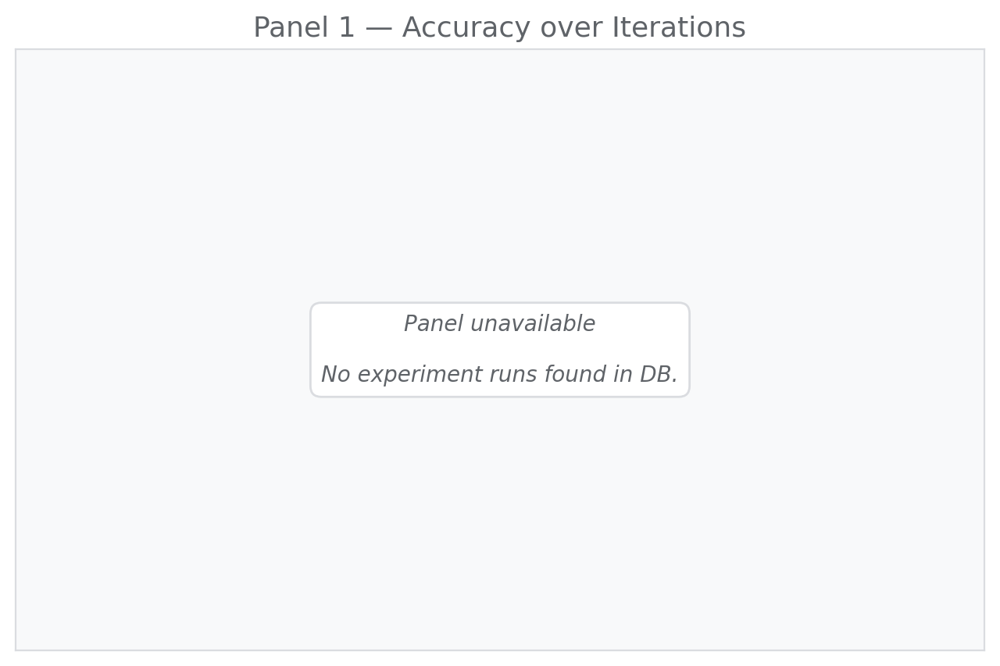
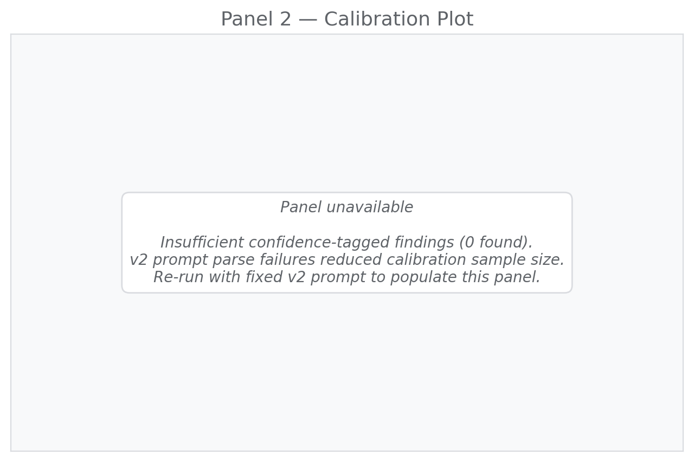
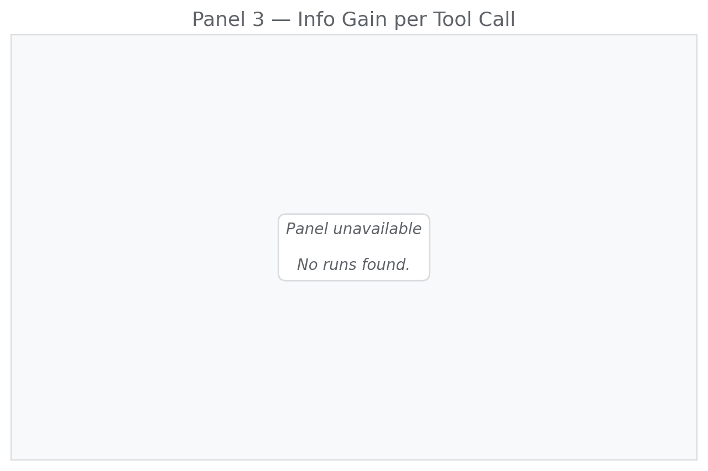
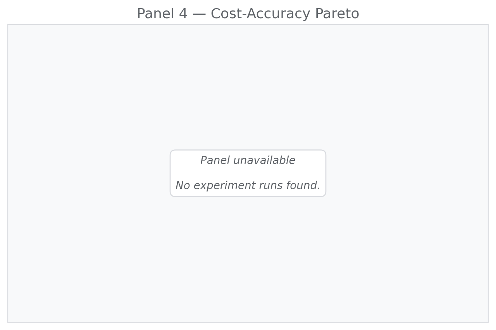
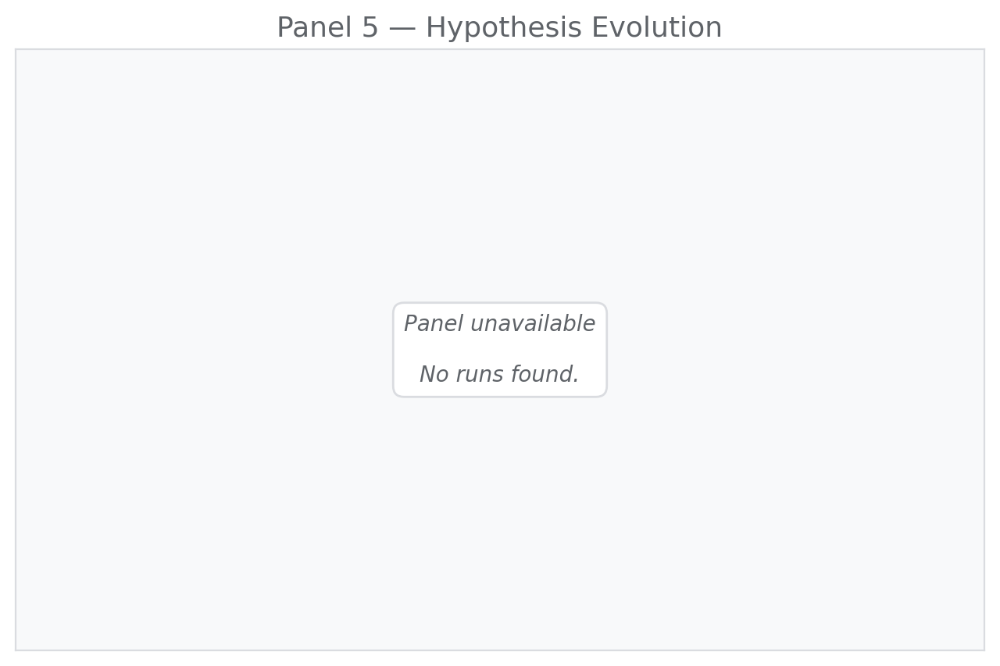
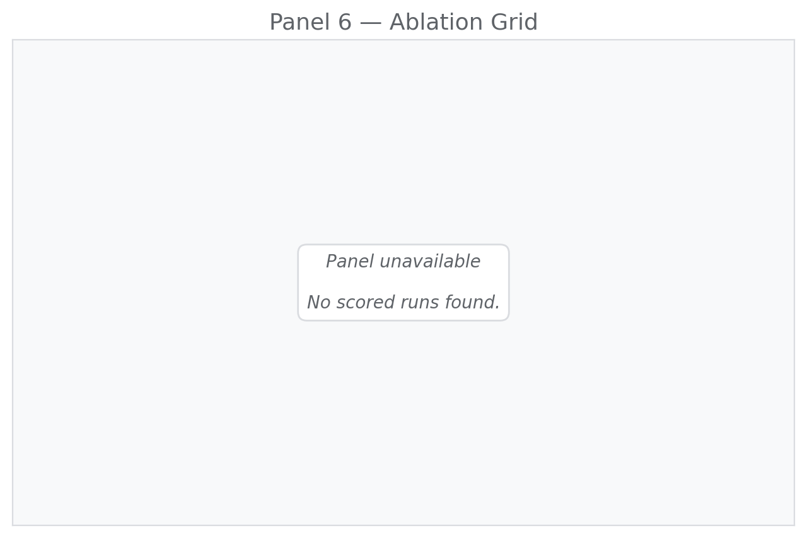
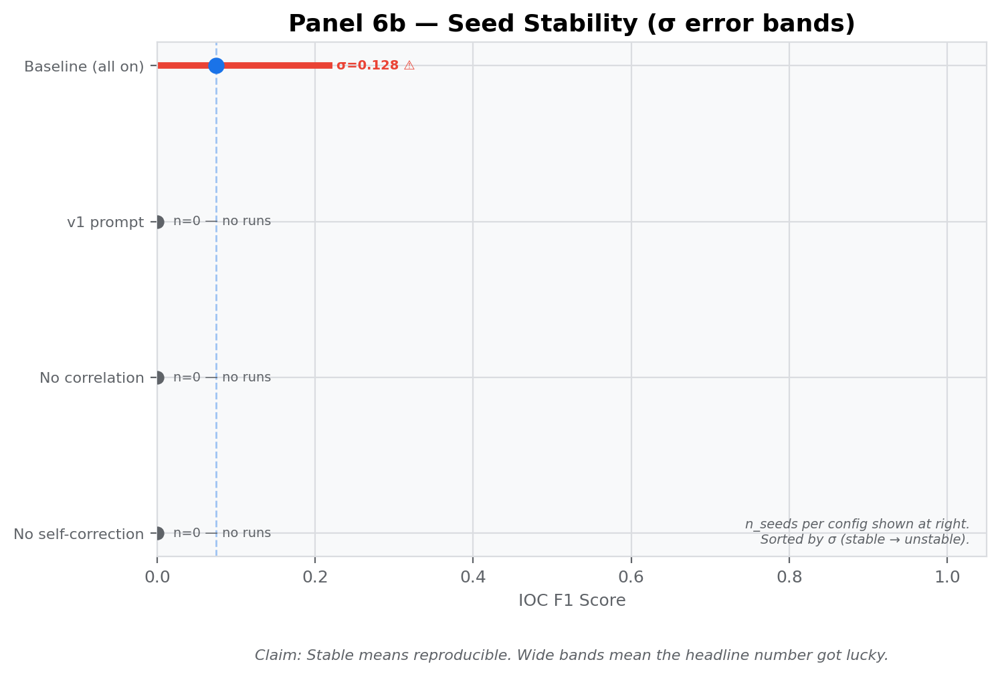

# SIFTGuard Empirical Operating Characteristic Report

**Case:** TEST-004
**Generated:** 2026-05-10 08:34 UTC

## Data Quality Notes

- v2 prompt parse failures fell back to v1 synthesis on several runs. These runs are included in accuracy/ablation panels and excluded from the calibration panel. The parse failure root cause (model emitting tool name strings in `supporting_audit_entry_ids` instead of integers) is documented and fixed in the v2 prompt update (commit: fix/prompt-audit-ids).
- Single-seed runs. Confidence intervals not estimated.

<!-- methodology v1.0.0 · EVAL_FRAMEWORK.md · sha256:ed5133e4b3bc… -->

## Panel 1

**Claim:** Accuracy improves monotonically with iteration count and plateaus — self-correction drives improvement.

**Status:** placeholder

**Data:** {
  "status": "placeholder"
}

## Panel 2

**Claim:** Agent confidence is well-calibrated: stated confidence matches empirical accuracy.

**Status:** placeholder

**Data:** {
  "status": "placeholder",
  "n_findings": 0
}

## Panel 3

**Claim:** Marginal information gain diminishes after tool call N — justifying the max-iterations cap.

**Status:** placeholder

**Data:** {
  "status": "placeholder"
}

## Panel 4

**Claim:** The Pareto frontier identifies the optimal accuracy-per-dollar operating point for deployment.

**Status:** placeholder

**Data:** {
  "status": "placeholder"
}

## Panel 5

**Claim:** The agent forms, revises, and confirms hypotheses in light of evidence — belief evolution is observable.

**Status:** placeholder

**Data:** {
  "status": "placeholder"
}

## Panel 6

**Claim:** Each feature's contribution is measured independently. Ablation reveals what actually matters.

**Status:** placeholder

**Data:** {
  "status": "placeholder"
}

## Panel 7

**Claim:** Stable means reproducible. Wide bands mean the headline number got lucky.

**Status:** ok

**Data:** {
  "status": "ok"
}

## Panel 8

**Claim:** Multi-model comparison: same MCP server, same ground truth, different model — vendor-risk decision matrix.

**Status:** stub

**Data:** {
  "status": "stub",
  "task": "Task 8"
}

No verified findings in traces. Run verifier first.
